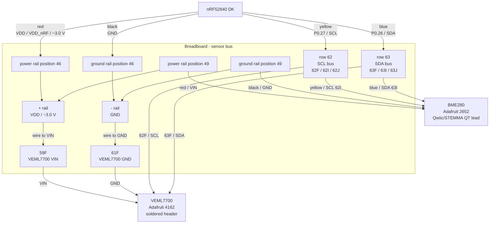
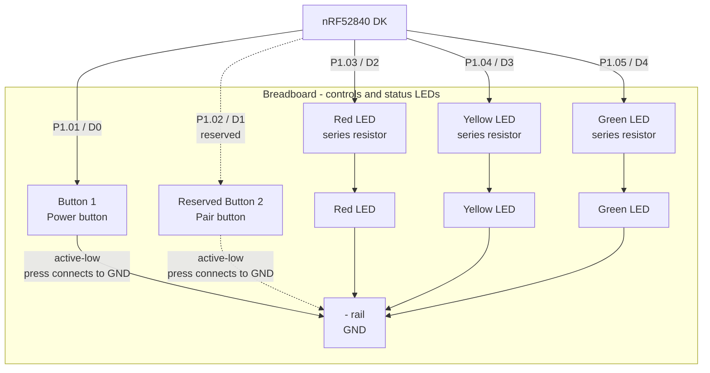

# Sap

Sensor Array for Plants (S.A.P) is an embedded project for the nRF52840 DK that utilizes the BME280 and VEML7700 sensors.

## Hardware Prototype

### Components

- nRF52840 DK
- Breadboard
- Jumper wires
- Adafruit BME280 2652
- Adafruit VEML7700 4162
- 2 × momentary push button
- 1 × LED red
- 1 × LED yellow
- 1 × LED green
- 3 × Resistors 470 Ω


### Pin Allocation

| Function          | nRF52840 pin | External label | Notes                                 |
| ----------------- | -----------: | -------------: | ------------------------------------- |
| I2C SDA           |      `P0.26` |          `SDA` | Shared by BME280 and VEML7700         |
| I2C SCL           |      `P0.27` |          `SCL` | Shared by BME280 and VEML7700         |
| Button 1          |      `P1.01` |           `D0` | Active-low input with pull-up         |
| Reserved button 2 |      `P1.02` |           `D1` | Reserved for second active-low button |
| Red LED           |      `P1.03` |           `D2` | PWM-capable GPIO output               |
| Yellow LED        |      `P1.04` |           `D3` | PWM-capable GPIO output               |
| Green LED         |      `P1.05` |           `D4` | PWM-capable GPIO output               |

### Topology





### External Button Wiring

The external button is wired as an active-low input:

```text
P1.01 / D0 ---- button ---- GND
```

The pin should be configured with an internal pull-up:

```dts
gpios = <&gpio1 1 (GPIO_PULL_UP | GPIO_ACTIVE_LOW)>;
```

`P1.02 / D1` is reserved for the same wiring pattern if a second button is added later.

### External LED Wiring

Each external LED must have its own current-limiting resistor:

```text
P1.03 / D2 -> resistor -> red LED -> GND
P1.04 / D3 -> resistor -> yellow LED -> GND
P1.05 / D4 -> resistor -> green LED -> GND
```

---

## Setup

**Overlay**

[Overlay](./boards/nrf52840dk_nrf52840.overlay)

**Config**

[Config](prj.conf)

---

## Testing

### Sensor Test

**I2C Scan**

`i2c scan i2c@40003000`

```bash
00:             -- -- -- -- -- -- -- -- -- -- -- --
10: 10 -- -- -- -- -- -- -- -- -- -- -- -- -- -- --
20: -- -- -- -- -- -- -- -- -- -- -- -- -- -- -- --
30: -- -- -- -- -- -- -- -- -- -- -- -- -- -- -- --
40: -- -- -- -- -- -- -- -- -- -- -- -- -- -- -- --
50: -- -- -- -- -- -- -- -- -- -- -- -- -- -- -- --
60: -- -- -- -- -- -- -- -- -- -- -- -- -- -- -- --
70: -- -- -- -- -- -- -- 77
2 devices found on i2c@40003000
```

**Sensor Test**

_1. BME280_

`sensor get bme280@77`

```bash
channel type=13(ambient_temp) index=0 shift=16 num_samples=1 value=14470775997ns (24.899993)
channel type=14(press) index=0 shift=23 num_samples=1 value=14470775997ns (102.027343)
channel type=16(humidity) index=0 shift=21 num_samples=1 value=14470775997ns (76.375976)
```

_2. VEML7700_

`sensor get veml7700@10`

```bash
channel type=18(light) index=0 shift=4 num_samples=1 value=211120086669ns (11.000000)
```

### Button Test

### LED Test
