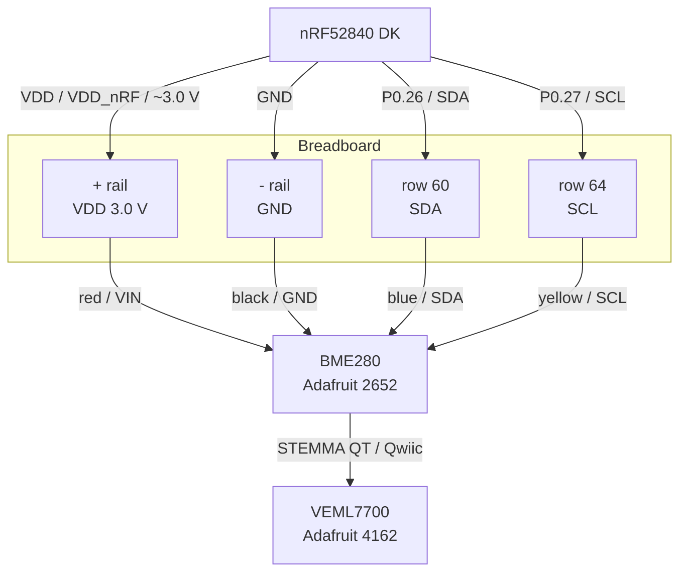

# Sap

Sensor Array for Plants (S.A.P) is an embedded project for the nrf52840 that utilizes the BME280 & VEML7700 sensors.

## Hardware

- nRF52840 DK
- Breadboard
- Adafruit BME280 2652
- Adafruit VEML7700 4162

### Topology



---

## Testing I2C & Sensors

### Pre-build

**Overlay**

- [x] BME280 definition
- [x] VEML7700 definition
- [x] Define pinctrl

[Overlay](./boards/nrf52840dk_nrf52840.overlay)

**Config**

```conf
CONFIG_I2C=y
CONFIG_SENSOR=y
CONFIG_BME280=y
CONFIG_VEML7700=y
CONFIG_LOG=y
CONFIG_I2C_LOG_LEVEL_DBG=y

# CONFIG_SHELL=y

# Required for i2c scan
# CONFIG_I2C_SHELL=y

# Required for sensor get
# CONFIG_SENSOR_SHELL=y
```

---

### Post-build

**I2C Scan**

`i2c scan i2c@40003000`

```bash
00:             -- -- -- -- -- -- -- -- -- -- -- --
10: 10 -- -- -- -- -- -- -- -- -- -- -- -- -- -- --
20: -- -- -- -- -- -- -- -- -- -- -- -- -- -- -- --
30: -- -- -- -- -- -- -- -- -- -- -- -- -- -- -- --
40: -- -- -- -- -- -- -- -- -- -- -- -- -- -- -- --
50: -- -- -- -- -- -- -- -- -- -- -- -- -- -- -- --
60: -- -- -- -- -- -- -- -- -- -- -- -- -- -- -- --
70: -- -- -- -- -- -- -- 77
2 devices found on i2c@40003000
```

**Sensor Test**

_1. BME280_
`sensor get bme280@77`

```bash
channel type=13(ambient_temp) index=0 shift=16 num_samples=1 value=14470775997ns (24.899993)
channel type=14(press) index=0 shift=23 num_samples=1 value=14470775997ns (102.027343)
channel type=16(humidity) index=0 shift=21 num_samples=1 value=14470775997ns (76.375976)
```

_2. VEML7700_

`sensor get veml7700@10`

```bash
channel type=18(light) index=0 shift=4 num_samples=1 value=211120086669ns (11.000000)
```

---
