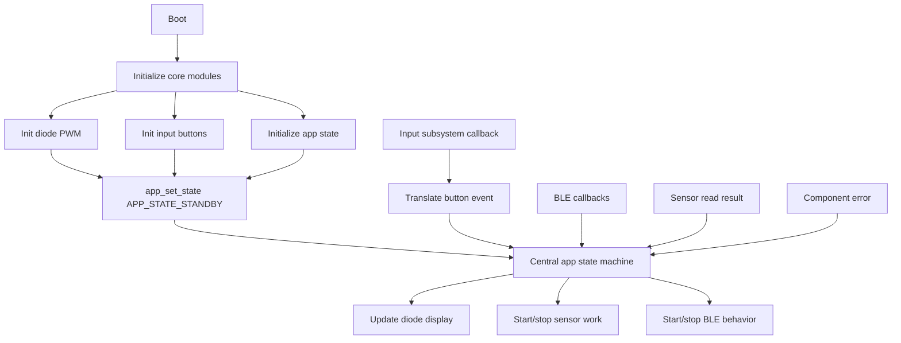
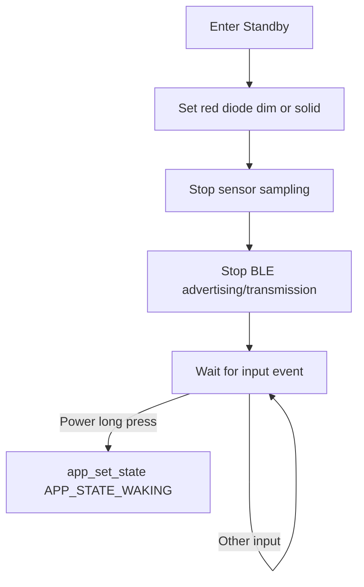
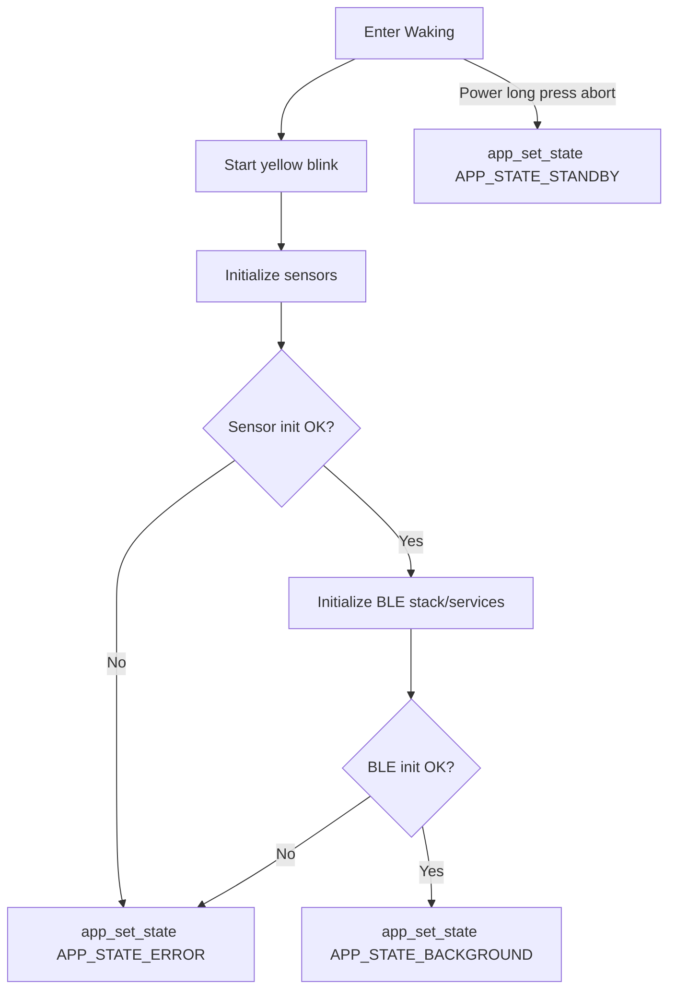
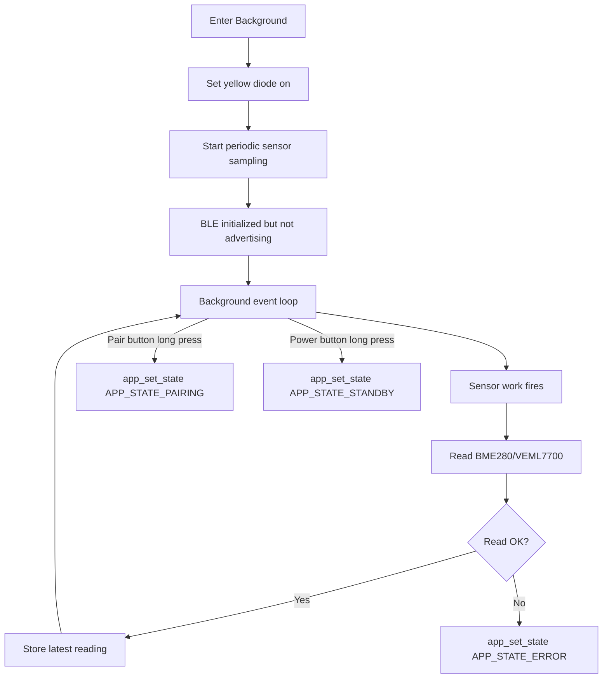
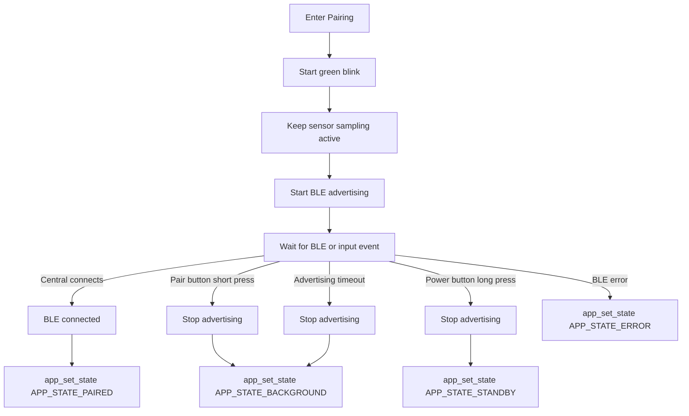
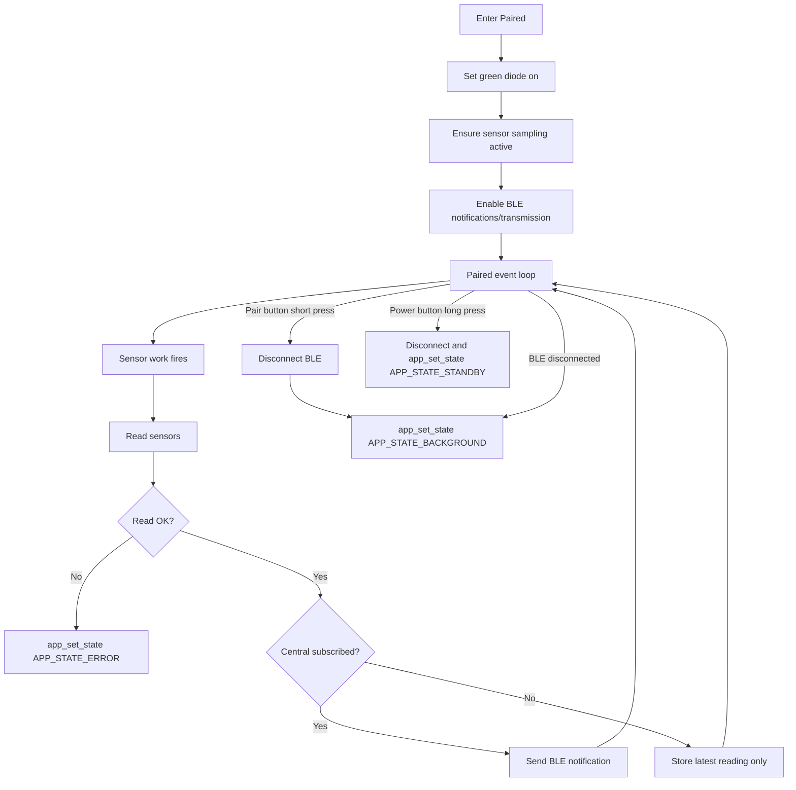
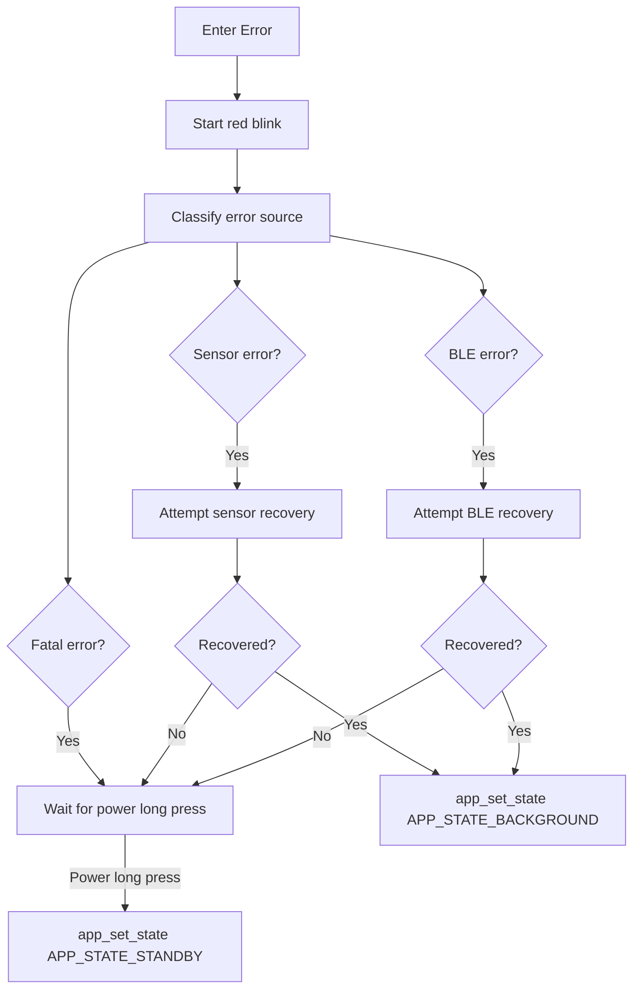
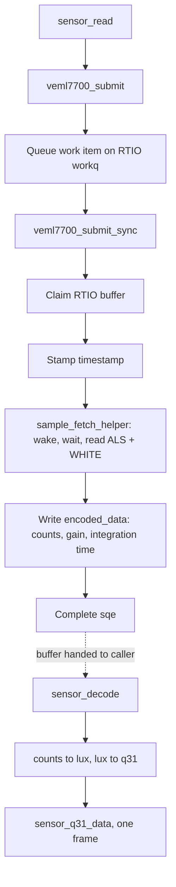

# SAP Architecture

Software design for the SAP application. Hardware wiring and bring-up live in the [README](../README.md).

Two subsystems are described here:

1. The application state machine, which decides what every component is allowed to do at any moment.
2. The custom VEML7700 sensor driver, which is maintained in this repository rather than pulled from Zephyr upstream.

---

## Application state machine

The application state is an enum (`APP_STATE_*` in [include/app_state.h](../include/app_state.h)) that defines the rules and roles for each component at each stage of the runtime. All transitions go through `app_set_state`.

### Runtime execution model



### Standby

**Type:** Steady state

| Component    | Allowed Action      |
| ------------ | ------------------- |
| Red Diode    | Dim                 |
| Yellow Diode | Off                 |
| Green Diode  | Off                 |
| Power Button | Short press to wake |
| Pair Button  | Off                 |
| Sensor       | Off                 |
| Bluetooth    | Off                 |

**Process Loop:**



### Waking

**Type:** Transition state

| Component    | Action                         |
| ------------ | ------------------------------ |
| Red Diode    | Off                            |
| Yellow Diode | Blinking                       |
| Green Diode  | Off                            |
| Power Button | Long press to abort to standby |
| Pair Button  | Ignored during init            |
| Sensor       | Initializing                   |
| Bluetooth    | Initializing                   |

**Process Execution:**



### Background

**Type:** Steady state

| Component    | Action                 |
| ------------ | ---------------------- |
| Red Diode    | Off                    |
| Yellow Diode | On                     |
| Green Diode  | Off                    |
| Power Button | Long press to standby  |
| Pair Button  | Long press to pairing  |
| Sensor       | Periodic reading       |
| Bluetooth    | Ready, not advertising |

**Process Loop:**



### Pairing

**Type:** Transition state

| Component    | Action                    |
| ------------ | ------------------------- |
| Red Diode    | Off                       |
| Yellow Diode | Off                       |
| Green Diode  | Blinking                  |
| Power Button | Long press to standby     |
| Pair Button  | Short press to background |
| Sensor       | Periodic reading          |
| Bluetooth    | Advertising               |

**Process Execution:**



### Paired

**Type:** Steady state

| Component    | Action                                      |
| ------------ | ------------------------------------------- |
| Red Diode    | Off                                         |
| Yellow Diode | Off                                         |
| Green Diode  | On                                          |
| Power Button | Long press to standby                       |
| Pair Button  | Short press to disconnect/background        |
| Sensor       | Periodic reading                            |
| Bluetooth    | Connected; transmits when subscribed/needed |

**Process Loop:**



### Error

**Type:** Fault state with optional recovery

| Component    | Action                  |
| ------------ | ----------------------- |
| Red Diode    | Blinking                |
| Yellow Diode | Off                     |
| Green Diode  | Off                     |
| Power Button | Long press to standby   |
| Pair Button  | Usually ignored         |
| Sensor       | Depends on error source |
| Bluetooth    | Depends on error source |

**Process Loop:**



_TODO: blink at different speeds to represent different error states._

---

## VEML7700 driver

The BME280 uses the upstream Zephyr driver. The VEML7700 uses a custom driver kept in [drivers/sensor/veml7700/](../drivers/sensor/veml7700/).

| File                  | Responsibility                                   |
| --------------------- | ------------------------------------------------ |
| `veml7700.h`          | Register map, enums, resolution table, structs   |
| `veml7700.c`          | Register access, config, fetch/get, attrs, PM    |
| `veml7700_async.c`    | Read-and-decode submit path                      |
| `veml7700_decoder.c`  | Decodes a captured sample into q31 lux           |

### Build integration

The driver is registered as a Zephyr **module**, not added with `add_subdirectory`. Zephyr snapshots the library list (`ZEPHYR_LIBS`) at configure time, inside `find_package(Zephyr)`. Anything added afterwards by the application compiles but never reaches the link. Registering it as a module via `ZEPHYR_EXTRA_MODULES` before `find_package` puts the library in that list in time.

The driver binds to a private compatible, `custom,veml7700`, defined in [dts/bindings/sensor/custom,veml7700.yaml](../dts/bindings/sensor/custom,veml7700.yaml). Using the upstream `vishay,veml7700` compatible would make both this driver and the in-tree one match the same node and define the same device.

### Measurement modes

The sensor has no data-ready flag, so the driver never polls for completion.

| Mode                       | `psm-mode` | Behaviour                                                             |
| -------------------------- | ---------- | --------------------------------------------------------------------- |
| Single shot                | `0x00`     | Sensor rests shut down. Each read wakes it, waits, reads, shuts it down |
| Power saving (continuous)  | non-zero   | Sensor free-runs. Each read returns the most recent sample immediately |

In single shot mode a read costs the startup delay plus roughly twice the integration time, so a default 100 ms integration means a read blocks for about 200 ms. Continuous mode trades standby current for read latency.

### Lux conversion

The ALS register returns raw counts. Lux depends on the gain and integration time that were active during the measurement:

```text
lux = counts * resolution[gain][integration_time]
```

The resolution table is transcribed from the Vishay application note "Designing the VEML7700 Into an Application" (document 84323).

Two details drive the design:

- Gain enum values are the raw register field encodings, so they double as table indices.
- Integration time register encodings are not contiguous or time ordered (25 ms is `0b1100`, 100 ms is `0b0000`). The enum is therefore a dense 0 to 5 index, and a lookup table converts it to register bits when writing config.

Every captured sample carries the gain and integration time that produced it. That is what makes deferred conversion safe: the decoder can run later, after `attr_set` may have changed the live settings, and still convert correctly.

### Read and decode

The driver implements Zephyr's read-and-decode API alongside the classic fetch/get API. The split is that capture does no maths and decode does no I/O.



The fetch can sleep for the integration time, so `submit` hands the work to the RTIO work queue rather than running it on the caller. This requires `CONFIG_RTIO_WORKQ`.

Decoded lux is emitted as q31 fixed point, where the real value is `value * 2^shift / 2^31`. The driver uses `shift = 18`, which spans up to 262144 lux (above the sensor maximum of roughly 140 klx) and leaves 13 fractional bits, about 0.0001 lux of resolution.

The sensor has no FIFO, so a buffer always holds exactly one frame.

### Runtime configuration

Gain, integration time, interrupt persistence and the two thresholds are settable at runtime through `attr_set`. Thresholds are given in lux and converted to counts using the active gain and integration time.

### Auto ranging is the application's job

The Vishay note describes a gain and integration time search: start at the lowest gain, and if counts are too low step the gain up, then extend the integration time. That loop is deliberately not in the driver. It requires several sequential measurements with reconfiguration between each, which would make a single read take seconds. The driver supplies the mechanism (raw counts out, gain and integration time in) and the application owns the policy.

### Power management

`PM_DEVICE_ACTION_SUSPEND` forces the sensor into shutdown for lowest power draw. `PM_DEVICE_ACTION_RESUME` restores the resting state for the configured mode: shut down for single shot, powered for continuous. Register contents survive shutdown because VDD stays applied, so resume only needs to rewrite `ALS_CONF`.
