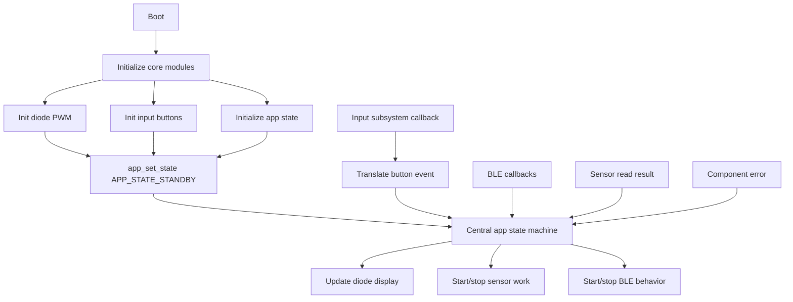
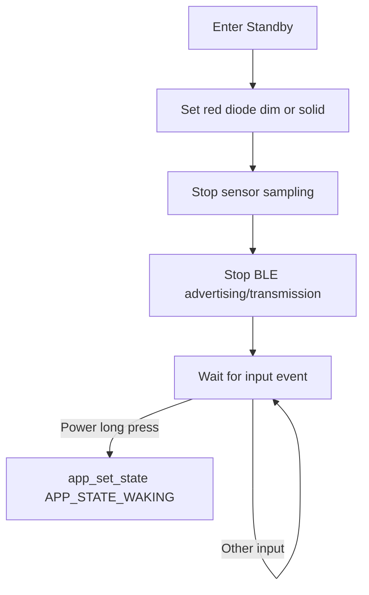
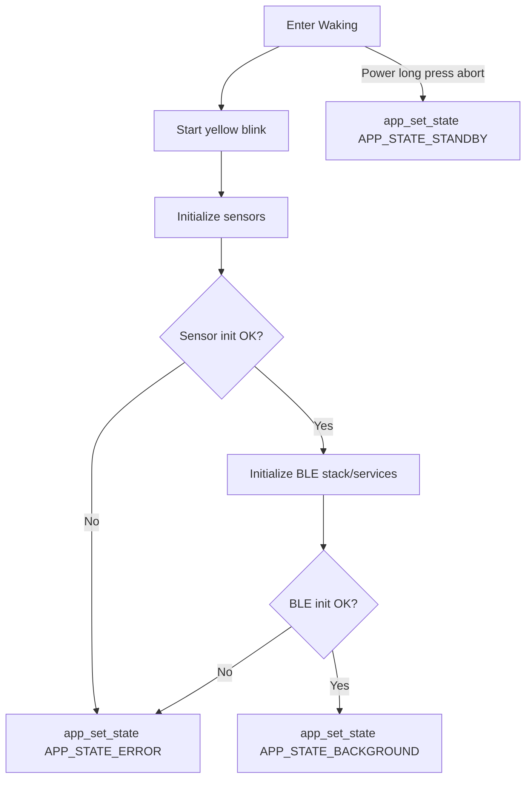
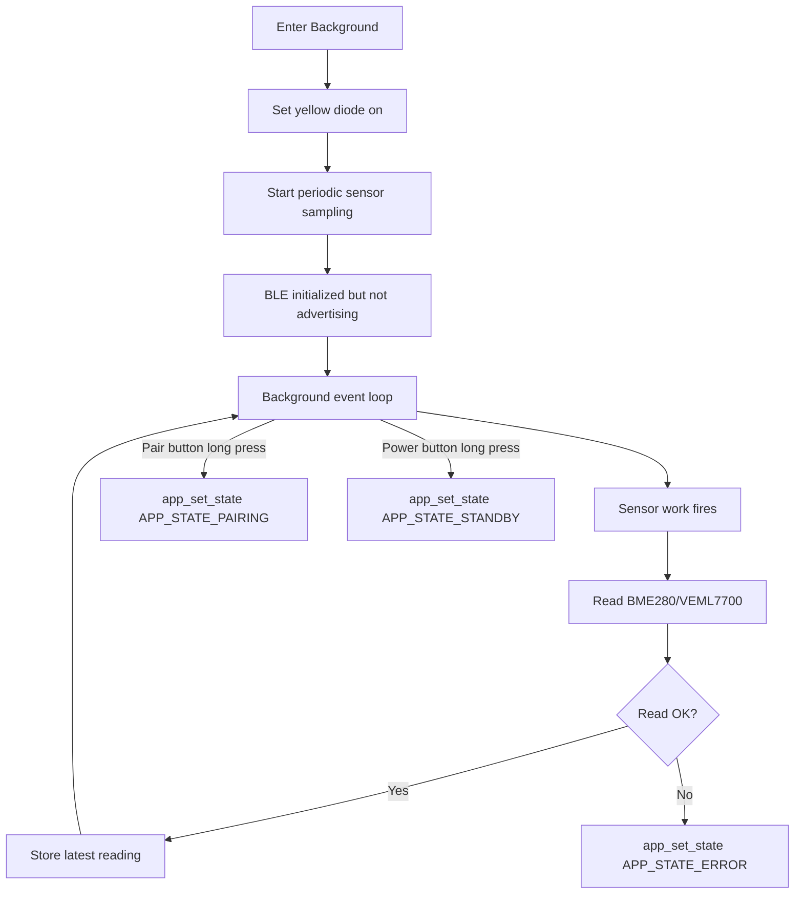
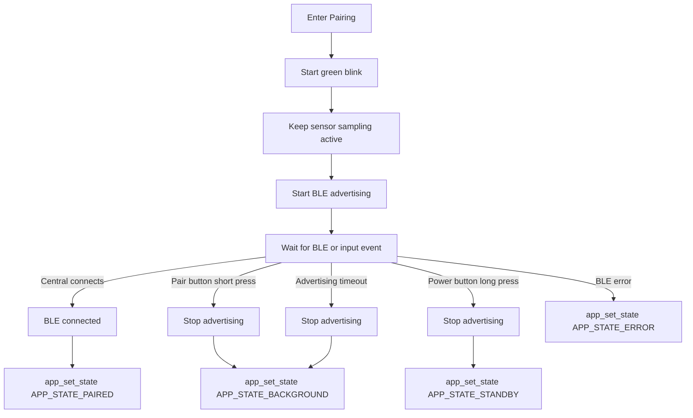
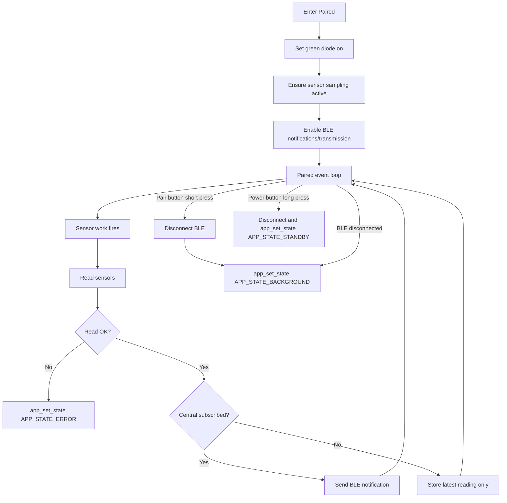
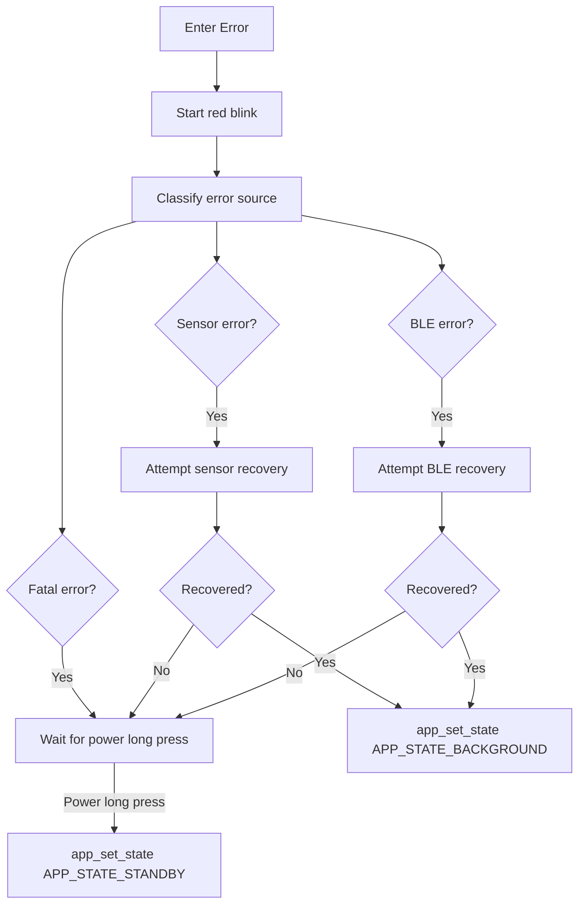

# SAP Architecture

## App State

The application state is an enum which defines the rules and roles for each component at each stage in the runtime.

### Runtime Execution Model

### Standby

**Type:** Steady state

| Component    | Allowed Action      |
| ------------ | ------------------- |
| Red Diode    | Dim                 |
| Yellow Diode | Off                 |
| Green Diode  | Off                 |
| Power Button | Short press to wake |
| Pair Button  | Off                 |
| Sensor       | Off                 |
| Bluetooth    | Off                 |

**Process Loop:**

### Waking

**Type:** Transition state

| Component    | Action                         |
| ------------ | ------------------------------ |
| Red Diode    | Off                            |
| Yellow Diode | Blinking                       |
| Green Diode  | Off                            |
| Power Button | Long press to abort to standby |
| Pair Button  | Ignored during init            |
| Sensor       | Initializing                   |
| Bluetooth    | Initializing                   |

**Process Execution:**

### Background

**Type:** Steady state

| Component    | Action                 |
| ------------ | ---------------------- |
| Red Diode    | Off                    |
| Yellow Diode | On                     |
| Green Diode  | Off                    |
| Power Button | Long press to standby  |
| Pair Button  | Long press to pairing  |
| Sensor       | Periodic reading       |
| Bluetooth    | Ready, not advertising |

**Process Loop:**

### Pairing

**Type:** Transition state

| Component    | Action                    |
| ------------ | ------------------------- |
| Red Diode    | Off                       |
| Yellow Diode | Off                       |
| Green Diode  | Blinking                  |
| Power Button | Long press to standby     |
| Pair Button  | Short press to background |
| Sensor       | Periodic reading          |
| Bluetooth    | Advertising               |

**Process Execution:**

### Paired

**Type:** Steady state

| Component    | Action                                      |
| ------------ | ------------------------------------------- |
| Red Diode    | Off                                         |
| Yellow Diode | Off                                         |
| Green Diode  | On                                          |
| Power Button | Long press to standby                       |
| Pair Button  | Short press to disconnect/background        |
| Sensor       | Periodic reading                            |
| Bluetooth    | Connected; transmits when subscribed/needed |

**Process Loop:**

**Roles:**

| Component    | Action                                     |
| ------------ | ------------------------------------------ |
| Red Diode    | Off                                        |
| Yellow Diode | Off                                        |
| Green Diode  | On                                         |
| Power Button | Long press to set standby                  |
| Pair Button  | Short press to set background (disconnect) |
| Sensor       | Reading                                    |
| Bluetooth    | Transmitting                               |

### Error

**Type:** Fault state with optional recovery

**Process Loop:**

**Roles:**

| Component    | Action                  |
| ------------ | ----------------------- |
| Red Diode    | Blinking                |
| Yellow Diode | Off                     |
| Green Diode  | Off                     |
| Power Button | Long press to standby   |
| Pair Button  | Usually ignored         |
| Sensor       | Depends on error source |
| Bluetooth    | Depends on error source |

_TODO: blink at different speeds to represent different error states_
